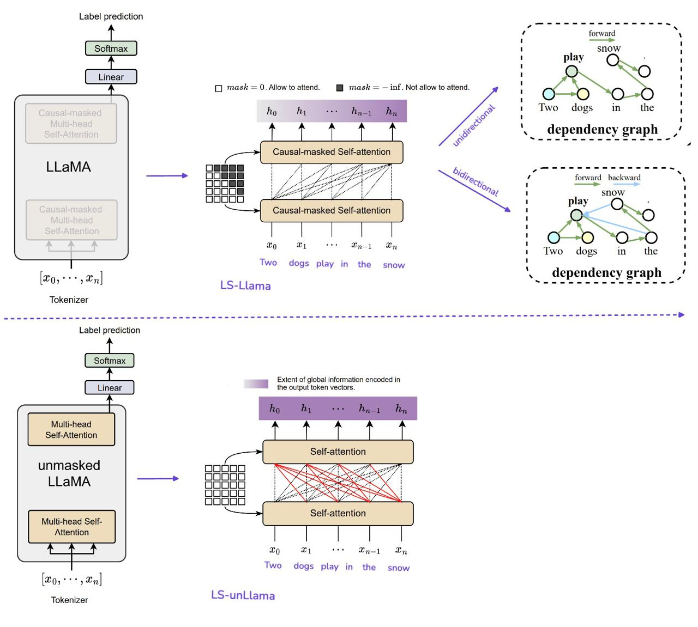

# L3i++ at GenAI Detection Task 1: Can Label-Supervised LLaMA Detect Machine-Generated Text?

[Subtasks](#subtasks) | [Data](#data) | [Models](#models) | [Contributors](#contributors)

The widespread use of large language models (LLMs) influences different social media and educational contexts through the overwhelming generated text with a certain degree of coherence. To mitigate their potential misuse, this repo explores the feasibility of finetuning LLaMA with label supervision (named LS-LLaMA) in unidirectional and bidirectional settings, to discriminate the texts generated by machines and humans in monolingual and multilingual corpora.

## Subtasks

Please checkout the webpage [Workshop on Detecting AI Generated Content](https://github.com/mbzuai-nlp/COLING-2025-Workshop-on-MGT-Detection-Task1/tree/main).

## Data

We evaluate the feasibility of our approach with [English](https://huggingface.co/datasets/Jinyan1/COLING_2025_MGT_en) and [multilingual](https://huggingface.co/datasets/Jinyan1/COLING_2025_MGT_multingual) corpora from Wang et al. (2025). Both corpora are the continuation and improvement of Wang et al. (2024a) with additional training and testing data generated from novel LLMs and including new languages.

## Models

## Contributors

- [@honghanhh](https://github.com/honghanhh)
- [@nguyennampfiev](https://github.com/nguyennampfiev)

## Reference

- [LS-LLaMA: Label Supervised LLaMA Finetuning](https://github.com/4AI/LS-LLaMA)
- [BeLLM: Backward Dependency Enhanced Large Language Model for Sentence Embeddings](https://github.com/WhereIsAI/BiLLM)